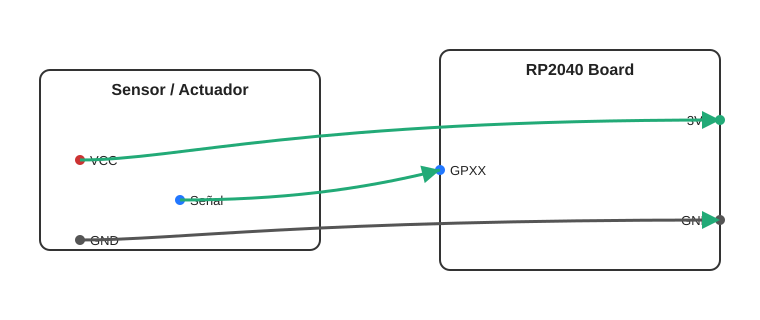

# [Pn] · Título de la práctica (RP2040 + C++)

Breve descripción: qué hace la práctica y qué aprenderás.

## Objetivos
- Objetivo 1
- Objetivo 2
- Objetivo 3

## Materiales
- RP2040 board (Raspberry Pi Pico, etc.)
- Sensores/actuadores
- Cableado

## Diagrama de conexiones

- Fuente Mermaid: `assets/wiring.mmd`.

## Mapa de pines

Consulta `PINES.md` para ver el mapeo detallado.

## Código / Proyecto

- Toolchain a elección (Pico SDK/PlatformIO/Arduino-Pico).
- Incluye los pasos para compilar y cargar.

## Visualización/Pruebas
- Si emites CSV por serial, documenta formato y cómo graficar.
- Alternativamente, logs con prefijos para depuración.

## Actividades sugeridas
- Extensión/ajuste 1
- Extensión/ajuste 2

## Solución de problemas
- Problema común 1 → Solución
- Problema común 2 → Solución

## Licencia y créditos
Uso académico.
