# P2 · Adquisición de Datos Analógicos (ADC) – Sensor de Posición (ESP32 + MicroPython)

Esta práctica replica la metodología de P1 aplicándola al ADC del ESP32 para leer un sensor de posición analógico (p. ej., potenciómetro), filtrar la señal y exportar datos en formato CSV para análisis/gráficas.

## Objetivos

- Configurar el ADC del ESP32 (12 bits, atenuación 11 dB).
- Adquirir muestras a frecuencia fija y aplicar media móvil.
- Convertir cuentas ADC a voltaje y ángulo (mapeo lineal).
- Exportar datos como CSV para graficar/analizar.

## Materiales

- ESP32 DevKit.
- Potenciómetro (p. ej., 10 kΩ) o sensor de posición analógico equivalente.
- Jumpers y protoboard.

## Diagrama de conexiones

- Señal → GPIO34 (ADC1_CH6)
- VCC → 3V3
- GND → GND

- Fuente Mermaid: `assets/wiring.mmd`.
- Nota: Se usa atenuación 11 dB para rango ~0–3.3 V. No usar 5 V en la entrada analógica.

## Mapa de pines

Consulta `PINES.md` para el mapeo detallado.

## Código

Archivo principal: `main.py`

- Parámetros ajustables:
  - `ADC_PIN` (por defecto 34)
  - `FS_HZ` (frecuencia de muestreo, p. ej., 100 Hz)
  - `MA_WINDOW` (tamaño de la media móvil)
  - `ANGLE_MAX_DEG` (rango angular del sensor, p. ej., 300°)
- Salida CSV (con cabecera):
  - `t_ms,raw,avg,voltage_v,angle_deg`

## Ejecución (Pymakr)

1. Conecta la ESP32 por USB y selecciona el puerto en Pymakr.
2. Sube y ejecuta `main.py`.
3. Observa la consola: se imprimirán líneas CSV continuamente.
4. Interrumpe con `Ctrl+C` cuando desees detener.

## Visualización de datos

Guía rápida en `docs/oscilograma.md`.

- Opción rápida: copia las líneas CSV a un archivo `.csv` y ábrelo en Excel/LibreOffice para graficar `t_ms` vs `voltage_v` o `angle_deg`.
- Opción Python (PC): usa Matplotlib para graficar el CSV.

## Actividades sugeridas

- Calibra `ANGLE_MAX_DEG` según el rango real de tu sensor.
- Compara ruido con distintas `MA_WINDOW`.
- Cambia `FS_HZ` y observa la resolución temporal vs. carga.
- Introduce perturbaciones mecánicas controladas y registra el comportamiento.

## Solución de problemas

- Voltaje saturado o incoherente:
  - Verifica atenuación (11 dB) y alimentación (3.3 V).
  - Revisa el cableado y el pin configurado en `ADC_PIN`.
- Datos ruidosos: aumenta `MA_WINDOW`.
- Rendimiento/tiempo: reduce `FS_HZ` o evita prints excesivos (desactiva CSV si haces pruebas rápidas).

## Licencia y créditos

Material académico para prácticas con ESP32 + MicroPython. Ajusta y reutiliza esta estructura para P3–P8.
