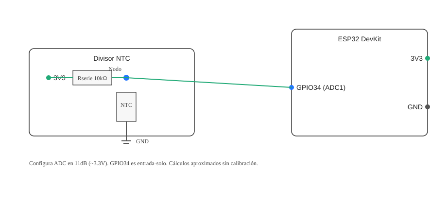

# Práctica 3 — Medición de Temperatura Aeronáutica con NTC (ESP32 + MicroPython)

Esta práctica mide temperatura usando una NTC en un divisor resistivo y el ADC del ESP32. Incluye modos para ver ADC, resistencia y temperatura, y un monitor CSV para graficar.

## Objetivos
- Cablear un divisor con NTC y leerlo con el ADC del ESP32.
- Calcular la temperatura con la ecuación Beta (R0, Beta, T0).
- Registrar datos (CSV) para ver dinámica térmica y ruido.

## Materiales
- ESP32 DevKit.
- NTC 10kΩ @25°C, Beta≈3950.
- Resistencia 10kΩ (serie) 1% recomendada.
- Protoboard y cables.

## Conexiones

- Ver `PINES.md` para tabla de pines y notas.
- Esquema Mermaid editable: `assets/wiring.mmd`.

## Mapa de pines (resumen)

- Nodo ADC: GPIO34 (ADC1, entrada‑solo)
- Rserie: 10kΩ a 3V3
- NTC: 10kΩ a GND
- 3V3 y GND comunes

## Uso (Pymakr)
1) Abre `MicroPython/ESP32/P3` en VS Code.
2) Conecta el ESP32, selecciona el puerto COM en Pymakr y “Connect”.
3) “Sync project” para subir archivos; “Run” o reinicia la placa.
4) En el REPL, elige modo (1–4) o espera el timeout (por defecto 3: temperatura).
	- Teclea `m` + ENTER para volver al menú en cualquier momento.

## Modos
1. ADC crudo: imprime `adc` y `V(nodo)`.
2. Resistencia: estima `Rntc`.
3. Temperatura: calcula `T(°C)` con Beta.
4. Monitor CSV: imprime `t_ms,adc,v_node_v,r_ntc_ohm,t_c`.

### Calibración (opcional)

- Modo 5: Calibración ADC (guía). Deshabilitada por defecto.
- Procedimiento desde el REPL:
	1) Conecta el nodo (GPIO34) a GND y escribe `ok` + ENTER.
	2) Conecta el nodo a 3V3 y escribe `ok` + ENTER.
	3) Se guardará `calibration.json` en la placa con `low` y `high`.
- Para que el programa use la calibración, edita en `main.py`:
	- Cambia `AUTO_USE_CALIBRATION = True` (por defecto `False`).
	- Al iniciar, se cargará `calibration.json` y se usará para mapear `adc → voltaje`.

## Parámetros ajustables (en `main.py`)
- `ADC_PIN=34`, `SAMPLES=16` (promedio por lectura).
- `V_SUPPLY=3.3`, `R_SERIES=10000`, `NTC_R0=10000`, `NTC_BETA=3950`, `T0_K=273.15+25`.

## Verificación
- A temperatura ambiente (~20–30°C), la `t_c` debe estar cerca de esa referencia.
- Al tocar la NTC (calentar), `t_c` sube; al soltar (enfriar), `t_c` baja.

## Notas y limitaciones
- El ADC del ESP32 presenta no linealidad; sin calibración, las lecturas son aproximadas.
- Para mejores resultados, mide la `V_SUPPLY` real y actualízala.
- Evita saturar 3.3V: usa 11dB de atenuación en el ADC (configurado por defecto).
 - La calibración lineal low/high mejora offset/ganancia, pero no corrige la no linealidad inherente.

## Visualización
- `docs/oscilograma.md` describe el CSV y las formas esperadas.
- Puedes graficar con Python (Matplotlib) o Excel.

## Recursos
- MicroPython ADC (ESP32): https://docs.micropython.org/en/latest/esp32/quickref.html#adc-analog-to-digital-conversion
- Termistores NTC — Ecuación Beta/Steinhart‑Hart (referencia general)
