# [Pn] · Título de la práctica (Plataforma + MicroPython)

Breve descripción: qué hace la práctica y qué aprenderás.

## Objetivos
- Objetivo 1
- Objetivo 2
- Objetivo 3

## Materiales
- Placa (ESP32 DevKit ...)
- Sensores/actuadores específicos
- Cables y protoboard

## Diagrama de conexiones

- Fuente Mermaid editable: `assets/wiring.mmd`.
- Notas de seguridad/voltaje si aplican.

## Mapa de pines

Consulta `PINES.md` para ver el mapeo detallado.

## Código

Archivo principal: `main.py`

- Parámetros ajustables al inicio (pines, frecuencias, constantes).
- Estructura recomendada: Config HW, Utilidades, Clases, Loop principal.
- Formato de salida: CSV con cabecera o logs con prefijos.

## Ejecución (Pymakr)
1. Conecta la placa por USB y selecciona el puerto en Pymakr.
2. Sube y ejecuta `main.py`.
3. Observa la consola y valida el comportamiento esperado.

## Calibración (opcional)

Si tu práctica requiere medición analógica precisa (ADC), considera añadir un modo de calibración y una bandera opcional en `main.py` para usarla cuando exista.

Sugerencia de flujo (idéntico al usado en P3):
- Modo de calibración por REPL (wizard):
	1) Conecta la entrada al GND y escribe `ok` + ENTER → mide `low`.
	2) Conecta la entrada al 3V3 y escribe `ok` + ENTER → mide `high`.
	3) Guarda `calibration.json` en la placa.
- Bandera en código: `AUTO_USE_CALIBRATION = False` (por defecto). Si la activas en `True`, la conversión `adc → voltaje` mapea linealmente `[low..high] → [0..Vref]`.
- Nota: esto corrige offset/ganancia básicos, no la no linealidad completa del ADC.

## Visualización de datos

Revisa `docs/oscilograma.md` para graficar y analizar datos (si aplica CSV).

## Actividades sugeridas
- Extensión/ajuste 1
- Extensión/ajuste 2
- Extensión/ajuste 3

## Solución de problemas
- Problema común 1 → Solución
- Problema común 2 → Solución
- Problema común 3 → Solución

## Licencia y créditos
Texto breve de licencia/uso académico.
