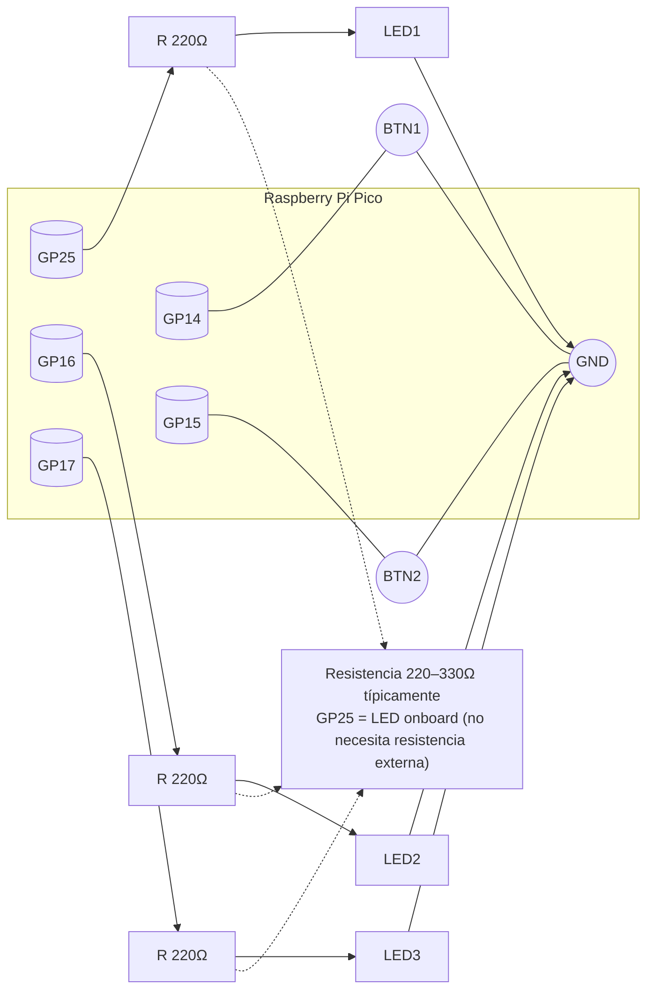

# Pines por defecto — Práctica P1 (RP2040 + MicroPython)

Este archivo documenta, de forma amigable, los pines usados por el código de `main.py`.

> Nota: Los pines están "hardcode" en el código. Si necesitas cambiarlos, edítalos en la sección "Configuración de pines" de `main.py`.

## Resumen de señales

- **LED1 (salida)**: GP25 — LED integrado onboard (Raspberry Pi Pico)
- **LED2 (salida)**: GP16 — LED externo opcional
- **LED3 (salida)**: GP17 — LED externo opcional
- **BTN1 (entrada)**: GP14 — Botón con pull-up interno (activo LOW)
- **BTN2 (entrada)**: GP15 — Botón con pull-up interno (activo LOW)
- Nivel activo de LEDs: alto (LED_ON_LEVEL = 1)

## Mapa visual (lógico)

```
LED1  <-- GP25  (LED onboard - parpadeo y secuencias)
LED2  <-- GP16  (chaser y refleja BTN1 en modo monitor)
LED3  <-- GP17  (chaser y refleja BTN2 en modo monitor)
BTN1  --> GP14  (pulsado = 0; pull-up interno)
BTN2  --> GP15  (pulsado = 0; pull-up interno)
```

## Comparativa ESP32 vs RP2040

| Señal | ESP32 (GPIO) | RP2040 (GP) |
|-------|--------------|-------------|
| LED1 (onboard) | GPIO 2 | GP25 |
| LED2 (externo) | GPIO 4 | GP16 |
| LED3 (externo) | GPIO 5 | GP17 |
| BTN1 | GPIO 13 | GP14 |
| BTN2 | GPIO 14 | GP15 |

## Diagrama de cableado (Mermaid)

Puedes ver/editar el archivo fuente en `assets/wiring.mmd`. GitHub y algunas extensiones de VS Code renderizan Mermaid automáticamente.



### SVG ya incluido

Se incluye una versión SVG en `assets/wiring.svg` para visualizar sin soporte Mermaid.

### ¿Cómo generar el SVG/PNG desde Mermaid en Windows (PowerShell)?

1. Instala Node.js (https://nodejs.org/)
2. Instala la CLI de Mermaid:

```powershell
npm install -g @mermaid-js/mermaid-cli
```

3. Genera el SVG (y opcionalmente PNG):

```powershell
# SVG transparente
mmdc -i assets/wiring.mmd -o assets/wiring.svg -b transparent

# PNG con fondo blanco (opcional)
mmdc -i assets/wiring.mmd -o assets/wiring.png -b white -w 1200
```

Notas:
- Si usas VS Code, también puedes instalar una extensión de Mermaid (p. ej., "Markdown Preview Mermaid Support") para previsualizar.
- Como alternativa, usa el editor web https://mermaid.live para pegar el contenido y exportar SVG/PNG.

## Dónde modificar en el código

En `main.py`, busca la sección "Configuración de pines (RP2040)":

```python
# LEDs (salidas)
LED1_PIN = 25  # LED integrado en Raspberry Pi Pico (onboard)
LED2_PIN = 16  # LED externo opcional (GP16)
LED3_PIN = 17  # LED externo opcional (GP17)

# Botones (entradas con pull-up)
BTN1_PIN = 14  # GP14
BTN2_PIN = 15  # GP15

LED_ON_LEVEL = 1  # 1 si el LED enciende con nivel alto; 0 para activo-bajo
```

- Para LEDs activos en bajo, cambia `LED_ON_LEVEL = 0`.
- Si usas otros pines, asegúrate de que sean GPxx válidos (0-28 en Pico estándar).
- Si tu placa tiene el LED integrado en otro pin, actualiza `LED1_PIN`.

## Consejos de conexión

- **LED onboard (GP25)**: No necesita conexión externa, está integrado en la placa.
- **LEDs externos**: Conecta resistencia en serie (220–330 Ω) al pin GPxx y el LED a GND.
- **Botones**: Un extremo a GPxx y el otro a GND; el `Pin.PULL_UP` interno mantiene el nivel alto cuando está suelto.
- **Voltaje**: RP2040 es 3.3V SOLAMENTE. NO uses 5V en los pines GPIO.

## Relación con los modos del programa

- **Modo 1 (Blink)**: Usa LED1 (GP25).
- **Modo 2 (Chaser)**: Usa LED1, LED2, LED3 en secuencia.
- **Modo 3 (Monitor)**: Lee BTN1/BTN2 y refleja su estado en LED2/LED3.
- **Modo 4 (Integrado)**: BTN1 cambia patrón (chaser ↔ blink-all) y BTN2 cambia velocidad.

## Pines disponibles RP2040 (Raspberry Pi Pico)

| Pin físico | GPIO | Función alternativa | Notas |
|------------|------|---------------------|-------|
| 1 | GP0 | UART0 TX, I2C0 SDA, SPI0 RX | |
| 2 | GP1 | UART0 RX, I2C0 SCL, SPI0 CSn | |
| 4 | GP2 | I2C1 SDA, SPI0 SCK | |
| 5 | GP3 | I2C1 SCL, SPI0 TX | |
| 6 | GP4 | UART1 TX, I2C0 SDA, SPI0 RX | |
| 7 | GP5 | UART1 RX, I2C0 SCL, SPI0 CSn | |
| ... | ... | ... | Ver datasheet completo |
| 31 | GP26 | ADC0, I2C1 SDA | **Canal ADC 0** |
| 32 | GP27 | ADC1, I2C1 SCL | **Canal ADC 1** |
| 34 | GP28 | ADC2 | **Canal ADC 2** |
| - | GP25 | LED onboard | **LED integrado** |

## Oscilogramas

Consulta `docs/oscilograma.md` para ver diagramas ASCII de las señales esperadas en los modos Blink y Chaser, y notas para medir con osciloscopio.
