# P2 · Adquisición de Datos Analógicos (ADC) – Sensor de Posición (RP2040 + MicroPython)

Esta práctica replica P2 de ESP32, adaptándola al ADC del RP2040 para leer un sensor de posición analógico (potenciómetro), filtrar la señal y exportar datos en formato CSV.

## Objetivos

- Configurar el ADC del RP2040 (12 bits reales, `read_u16()` con 16 bits de salida).
- Adquirir muestras a frecuencia fija y aplicar media móvil.
- Convertir cuentas ADC a voltaje y ángulo (mapeo lineal).
- Exportar datos como CSV para graficar/analizar.

## Diferencias clave vs ESP32

| Aspecto | ESP32 | RP2040 |
|---------|-------|--------|
| **Pines ADC** | GPIO32-39 (18 canales) | GP26, GP27, GP28 (3 canales) |
| **Función lectura** | `adc.read()` → 0-4095 | `adc.read_u16()` → 0-65535 |
| **Resolución real** | 12 bits | 12 bits (padding a 16) |
| **Configuración** | `atten()`, `width()` | Solo `ADC(pin)` |
| **Rango voltaje** | 0-3.6V (con 11dB) | 0-3.3V fijo |

## Materiales

- Raspberry Pi Pico (RP2040)
- Potenciómetro (p. ej., 10 kΩ) o sensor de posición analógico equivalente
- Jumpers y protoboard

## Diagrama de conexiones

- Señal → GP26 (ADC0) — Pin físico 31
- VCC → 3V3 (OUT) — Pin físico 36
- GND → GND — Pin físico 38



- Fuente Mermaid: `assets/wiring.mmd`
- **ADVERTENCIA**: NO usar 5V en GP26-28. Solo 3.3V máximo.

## Mapa de pines

Consulta `PINES.md` para el mapeo detallado y comparativa con ESP32.

## Código

Archivo principal: `main.py`

- Parámetros ajustables:
  - `ADC_PIN` (por defecto 26 = ADC0)
  - `FS_HZ` (frecuencia de muestreo, p. ej., 100 Hz)
  - `MA_WINDOW` (tamaño de la media móvil)
  - `ANGLE_MAX_DEG` (rango angular del sensor, p. ej., 300°)
- Salida CSV (con cabecera):
  - `t_ms,raw,avg,voltage_v,angle_deg`
  - `raw` es 0-65535 (16 bits), `avg` es el promedio filtrado

## Ejecución

### Con Thonny:
1. Conecta el Pico por USB.
2. Abre `main.py` en Thonny.
3. Selecciona intérprete "MicroPython (Raspberry Pi Pico)".
4. Presiona F5 para ejecutar.
5. Observa la consola: se imprimirán líneas CSV continuamente.
6. Interrumpe con `Ctrl+C` cuando desees detener.

### Con Pymakr:
1. Conecta el Pico y selecciona el puerto en Pymakr.
2. Sube `boot.py` y `main.py`.
3. Ejecuta `main.py`.
4. Observa la consola REPL.

## Visualización de datos

Guía rápida en `docs/oscilograma.md`.

- **Opción rápida**: Copia las líneas CSV a un archivo `.csv` y ábrelo en Excel/LibreOffice para graficar `t_ms` vs `voltage_v` o `angle_deg`.
- **Opción Python (PC)**: Usa Matplotlib para graficar el CSV.

Ejemplo Python para visualizar:
```python
import pandas as pd
import matplotlib.pyplot as plt

# Leer CSV (copiado desde REPL)
df = pd.read_csv('data.csv', comment='#')

# Graficar
plt.figure(figsize=(10, 6))
plt.subplot(2, 1, 1)
plt.plot(df['t_ms'], df['voltage_v'])
plt.ylabel('Voltaje (V)')
plt.grid(True)

plt.subplot(2, 1, 2)
plt.plot(df['t_ms'], df['angle_deg'])
plt.xlabel('Tiempo (ms)')
plt.ylabel('Ángulo (°)')
plt.grid(True)
plt.show()
```

## Actividades sugeridas

- Calibra `ANGLE_MAX_DEG` según el rango real de tu sensor.
- Compara ruido con distintas `MA_WINDOW` (prueba 4, 8, 16, 32).
- Cambia `FS_HZ` y observa la resolución temporal vs. carga.
- Introduce perturbaciones mecánicas controladas y registra el comportamiento.
- Compara 3 canales ADC simultáneamente (GP26, GP27, GP28).

## Solución de problemas

- **Voltaje saturado en 3.3V o 0V**:
  - Verifica alimentación del potenciómetro (debe ser 3.3V, no 5V).
  - Revisa el cableado y el pin configurado en `ADC_PIN`.
- **Datos ruidosos**: 
  - Aumenta `MA_WINDOW` (prueba 16 o 32).
  - Usa cable corto y apantallado para señal analógica.
  - Añade capacitor 100nF cerca del sensor.
- **Lecturas inestables**:
  - El ADC del RP2040 puede ser sensible; considera promediar múltiples lecturas.
  - Reduce impedancia de fuente (<10kΩ recomendado).
- **Rendimiento/tiempo**: 
  - Reduce `FS_HZ` si el sistema se ralentiza.
  - Evita prints excesivos (usa `PRINT_HEADER_EVERY > 0` para reducir salida).

## Verificación (criterios de aceptación)

- El REPL muestra cabecera CSV: `t_ms,raw,avg,voltage_v,angle_deg`
- Con potenciómetro al mínimo (~0Ω), `voltage_v ≈ 0.0V` y `angle_deg ≈ 0.0°`
- Con potenciómetro al máximo (~10kΩ), `voltage_v ≈ 3.3V` y `angle_deg ≈ 300.0°`
- Al girar suavemente, los valores cambian de forma continua sin saltos bruscos (media móvil funcionando)

## Preguntas de reflexión

1. ¿Por qué `read_u16()` devuelve 0-65535 si el ADC es de 12 bits? (Respuesta: padding con ceros en bits bajos)
2. ¿Cómo afecta el tamaño de `MA_WINDOW` al ruido vs. latencia de respuesta?
3. ¿Qué ventajas tiene el ADC del RP2040 frente al ESP32? ¿Y desventajas?
4. ¿Cómo calibrarías el ADC para compensar offset y ganancia no ideales?

## Recursos

- MicroPython ADC (RP2040): https://docs.micropython.org/en/latest/rp2/quickref.html#adc-analog-to-digital-conversion
- RP2040 Datasheet (ADC): https://datasheets.raspberrypi.com/rp2040/rp2040-datasheet.pdf#page=565
- Raspberry Pi Pico Pinout: https://datasheets.raspberrypi.com/pico/Pico-R3-A4-Pinout.pdf

## Licencia y créditos

Material académico para prácticas con RP2040 + MicroPython. Adaptado desde ESP32 por EU97/SISELA-Init.
