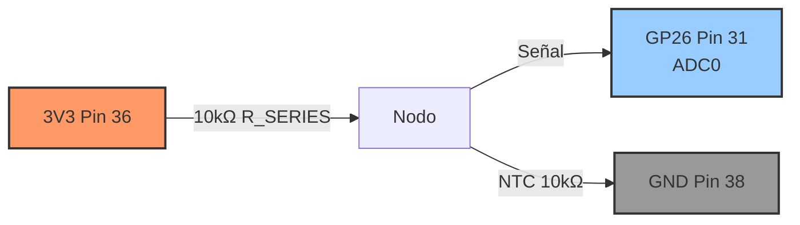

# P3 · Mapa de pines (RP2040 + NTC)

Configuración del divisor resistivo para medir temperatura con NTC en Raspberry Pi Pico.

## Conexiones Principales

- **VCC**: 3V3 (Pin 36)
- **R_SERIES**: 10kΩ (entre 3V3 y nodo)
- **NTC**: 10kΩ @25°C, Beta≈3950 (entre nodo y GND)
- **Nodo (señal)**: GP26 (Pin 31, ADC0)
- **GND**: GND (Pin 38 o cualquier GND)

---

## Tabla de Pines

| Señal      | Pin RP2040 | Pin Físico | Descripción                        |
|-----------:|------------|------------|------------------------------------|
| **VCC**    | 3V3        | 36         | Alimentación del divisor (3.3V)    |
| **Nodo**   | GP26       | 31         | Lectura ADC del divisor (ADC0)     |
| **GND**    | GND        | 38         | Tierra común                       |
| R_SERIES   | —          | —          | 10kΩ entre 3V3 y nodo              |
| NTC        | —          | —          | 10kΩ@25°C entre nodo y GND         |

---

## Comparativa: ESP32 vs RP2040

| Aspecto                | ESP32                | RP2040 (Pico)        |
|------------------------|----------------------|----------------------|
| **Pin ADC**            | GPIO34 (ADC1_CH6)    | GP26 (ADC0)          |
| **Canales ADC**        | 18 canales           | 3 canales (GP26-28)  |
| **Resolución ADC**     | 12-bit (0-4095)      | 12-bit (0-4095)      |
| **Función lectura**    | `adc.read()`         | `adc.read_u16()`     |
| **Rango devuelto**     | 0-4095               | 0-65535 (16-bit)     |
| **Configuración**      | `atten()`, `width()` | No requiere          |
| **Voltaje máximo**     | ~3.6V con ATTN_11DB  | 3.3V estricto        |
| **Inicialización**     | `ADC(Pin(34))`       | `ADC(26)`            |

---

## Esquema del Circuito

```
        3V3 (Pin 36)
         │
         ├─── R_SERIES (10kΩ)
         │
         ├─── Nodo ────► GP26 (Pin 31, ADC0)
         │
         └─── NTC (10kΩ @ 25°C, Beta≈3950)
              │
             GND (Pin 38)
```

**Funcionamiento**:
- El voltaje en el nodo varía según la temperatura de la NTC
- A mayor temperatura → menor resistencia NTC → mayor voltaje en nodo
- A menor temperatura → mayor resistencia NTC → menor voltaje en nodo

---

## Pinout Físico (Raspberry Pi Pico)

```
                   ┌─────────────┐
                   │   ┌─────┐   │
                   │   │ USB │   │
                   │   └─────┘   │
                   │             │
    GP0      1  ●──┤             ├──● 40  VBUS
    GP1      2  ●──┤             ├──● 39  VSYS
    GND      3  ●──┤             ├──● 38  GND ◄─── Tierra NTC
    GP2      4  ●──┤             ├──● 37  3V3_EN
    GP3      5  ●──┤             ├──● 36  3V3(OUT) ◄─── VCC divisor
    GP4      6  ●──┤             ├──● 35  ADC_VREF
    GP5      7  ●──┤             ├──● 34  GP28 (ADC2)
    GND      8  ●──┤             ├──● 33  GND
    GP6      9  ●──┤             ├──● 32  GP27 (ADC1)
    GP7     10  ●──┤             ├──● 31  GP26 (ADC0) ◄─── Nodo señal
    GP8     11  ●──┤             ├──● 30  RUN
    GP9     12  ●──┤             ├──● 29  GP22
    GND     13  ●──┤             ├──● 28  GND
    GP10    14  ●──┤             ├──● 27  GP21
    GP11    15  ●──┤  RP2040     ├──● 26  GP20
    GP12    16  ●──┤             ├──● 25  GP19
    GP13    17  ●──┤             ├──● 24  GP18
    GND     18  ●──┤             ├──● 23  GND
    GP14    19  ●──┤             ├──● 22  GP17
    GP15    20  ●──┤             ├──● 21  GP16
                   │             │
                   └─────────────┘
```

---

## Cálculos de Temperatura

### 1. ADC → Voltaje
```python
# RP2040
adc_val = adc.read_u16()  # 0-65535
voltage = (adc_val / 65535) * 3.3

# ESP32 (para comparación)
adc_val = adc.read()  # 0-4095
voltage = (adc_val / 4095) * 3.3
```

### 2. Voltaje → Resistencia NTC
```python
# Divisor resistivo: Vnode = Vcc * Rntc / (Rseries + Rntc)
# Despeje: Rntc = Rseries * Vnode / (Vcc - Vnode)
R_ntc = R_SERIES * voltage / (3.3 - voltage)
```

### 3. Resistencia → Temperatura
```python
# Ecuación Beta: 1/T = 1/T0 + (1/Beta)*ln(R/R0)
import math
R0 = 10000  # Ω @ 25°C
Beta = 3950
T0_K = 298.15  # 25°C en Kelvin

invT = (1.0 / T0_K) + (1.0 / Beta) * math.log(R_ntc / R0)
T_kelvin = 1.0 / invT
T_celsius = T_kelvin - 273.15
```

---

## Relación con los Modos

| Modo | Descripción                          | Salida                        |
|-----:|--------------------------------------|-------------------------------|
| **1** | ADC crudo                           | `adc=32768, V=1.650`          |
| **2** | Resistencia NTC                     | `Rntc=10000Ω`                 |
| **3** | Temperatura                         | `T=25.00°C`                   |
| **4** | Monitor CSV                         | `t,adc,V,R,T` (para graficar)|
| **5** | Calibración (guía interactiva)      | Guarda `calibration.json`     |

---

## Calibración del ADC (Opcional)

### ¿Cuándo calibrar?
- Si observas offset consistente en las mediciones
- Para mejorar precisión cerca de 0V y 3.3V
- Después de cambiar la fuente de alimentación

### Procedimiento (Modo 5):
1. Ejecuta `main.py` y selecciona modo `5`
2. **Paso 1**: Conecta GP26 directamente a **GND**, escribe `ok` + ENTER
3. **Paso 2**: Conecta GP26 directamente a **3V3**, escribe `ok` + ENTER
4. Se guarda `calibration.json` con valores `low` y `high`

### Activar calibración:
```python
# En main.py, línea ~87:
AUTO_USE_CALIBRATION = True  # Cambiar de False a True
```

**Nota**: La calibración lineal mejora offset/ganancia, pero el ADC de RP2040 es generalmente más lineal que el ESP32.

---

## Advertencias Importantes

### ⚠️ Voltaje Máximo
- **RP2040 ADC solo acepta 0-3.3V** (sin protección interna)
- **NO conectes 5V** a GP26 o dañarás el chip
- ESP32 tiene protección con atenuación 11dB, RP2040 no

### ⚠️ Pines ADC Limitados
- Solo **GP26, GP27, GP28** tienen ADC (3 canales)
- GP29 es ADC3 pero está conectado a VSYS en Pico estándar
- No uses otros pines GPIO para ADC

### ⚠️ Precisión
- RP2040 ADC es más lineal que ESP32 (no necesita calibración compleja)
- Temperatura medida depende de la precisión de Beta de la NTC
- Errores típicos: ±2°C sin calibración, ±0.5°C con calibración

---

## Diagrama Mermaid

Ver archivo editable: [`assets/wiring.mmd`](./assets/wiring.mmd)



---

## Verificación Rápida

### Test básico:
```python
from machine import ADC
adc = ADC(26)
print(adc.read_u16())  # Debe estar entre 0-65535
```

### Test con voltaje conocido:
1. Conecta GP26 a GND → debe leer ~0-500
2. Conecta GP26 a 3V3 → debe leer ~65000-65535
3. Mide con multímetro el voltaje del nodo NTC → compara con cálculo

### Rango esperado a temperatura ambiente (20-25°C):
- **ADC**: ~32000-35000 (con R_SERIES = NTC ≈ 10kΩ)
- **Voltaje**: ~1.6-1.7V (cerca de Vcc/2)
- **Temperatura**: 20-25°C

---

## Recursos Adicionales

- **RP2040 ADC**: https://docs.micropython.org/en/latest/rp2/quickref.html#adc-analog-to-digital-conversion
- **Pico Datasheet**: https://datasheets.raspberrypi.com/pico/pico-datasheet.pdf
- **RP2040 Datasheet** (ADC section): https://datasheets.raspberrypi.com/rp2040/rp2040-datasheet.pdf#page=565
- **NTC Thermistors**: Beta equation and Steinhart-Hart (general reference)

---

**Última actualización**: 2025-11-03  
**Plataforma**: RP2040 (Raspberry Pi Pico)  
**MicroPython**: v1.24+
