# Práctica 3 — Medición de Temperatura con NTC o LM35 (RP2040 + MicroPython)

Esta práctica mide temperatura usando una NTC (divisor resistivo) o un LM35 (salida lineal) conectados al ADC del Raspberry Pi Pico (RP2040). Incluye selección de sensor, modos por sensor y monitores CSV para graficar.

---

## 🎯 Objetivos

- Cablear y leer desde el ADC del RP2040 tanto un divisor NTC como un LM35
- Calcular temperatura con ecuación Beta (NTC: R0, Beta, T0) o lineal (LM35: 10 mV/°C)
- Registrar datos en CSV (10 Hz) para analizar dinámica térmica y ruido
- Comparar diferencias ADC entre RP2040 y ESP32

---

## 📦 Materiales

- **Raspberry Pi Pico** (RP2040)
- **Opción NTC**: NTC 10kΩ @25°C (Beta≈3950) + resistencia serie 10kΩ (1%)
- **Opción LM35**: LM35DZ o similar (Vout proporcional a °C)
- **Protoboard** y cables jumper
- **Cable USB** (para alimentación y comunicación)
- **Multímetro** (opcional)

---

## 🔌 Conexiones



**Ver detalles completos en**: [`PINES.md`](./PINES.md)

### Esquemas simplificados

NTC (divisor):
```
3V3 (Pin 36) ──┬─── 10kΩ R_SERIES ───┬─── GP26 (Pin 31, ADC0)
               │                      │
               └─── NTC 10kΩ ─────────┴─── GND (Pin 38)
```

LM35 (directo):
```
LM35: Vs → 3V3, GND → GND, Vout → GP26 (ADC0)
```

### Mapa de Pines (resumen)

| Componente | Conexión           | Pin Físico |
|------------|--------------------|------------|
| R_SERIES   | 3V3 → Nodo (NTC)   | 36 → nodo  |
| NTC        | Nodo → GND         | nodo → 38  |
| LM35 Vout  | Vout → GP26        | LM35 → 31  |
| Señal ADC  | Nodo/Vout → GP26   | nodo → 31  |

---

## 🆚 Diferencias: ESP32 vs RP2040

| Característica         | ESP32                          | RP2040 (Pico)               |
|------------------------|--------------------------------|-----------------------------|
| **Pin ADC**            | GPIO34 (ADC1_CH6)              | GP26 (ADC0)                 |
| **Canales ADC**        | 18 canales (GPIO32-39)         | 3 canales (GP26-GP28)       |
| **Función lectura**    | `adc.read()`                   | `adc.read_u16()`            |
| **Rango valores**      | 0-4095 (12-bit)                | 0-65535 (16-bit)            |
| **Inicialización**     | `ADC(Pin(34))`                 | `ADC(26)`                   |
| **Configuración**      | `atten()`, `width()` requerido | No requiere configuración   |
| **Voltaje máximo**     | ~3.6V (con ATTN_11DB)          | 3.3V estricto (sin protección) |
| **Linealidad**         | Baja (requiere calibración)    | Alta (calibración opcional) |
| **Conversión voltaje** | `(adc/4095) * 3.3`             | `(adc/65535) * 3.3`         |

### Cambios Clave en el Código

```python
# ESP32
from machine import Pin, ADC
adc = ADC(Pin(34))
adc.atten(ADC.ATTN_11DB)
adc.width(ADC.WIDTH_12BIT)
raw = adc.read()  # 0-4095
voltage = (raw / 4095) * 3.3

# RP2040
from machine import ADC
adc = ADC(26)  # GP26 = ADC0, sin Pin() wrapper
raw = adc.read_u16()  # 0-65535
voltage = (raw / 65535) * 3.3
```

---

## 🚀 Uso (Thonny o Pymakr)

### Opción 1: Thonny (Recomendado)
1. Abre **Thonny IDE**
2. Conecta el Pico, selecciona intérprete: `MicroPython (Raspberry Pi Pico)`
3. Abre `main.py` desde `MicroPython/RP2040/P3`
4. Guarda en el Pico: **File > Save as... > Raspberry Pi Pico**
5. Presiona **F5** para ejecutar

### Opción 2: VS Code + Pymakr
1. Abre `MicroPython/RP2040/P3` en VS Code
2. Conecta el Pico, selecciona puerto en Pymakr y **Connect**
3. **Sync project** para subir archivos
4. **Run** o reinicia la placa

### Interacción en REPL
1. Al iniciar, selecciona sensor: `1=NTC`, `2=LM35` (timeout 5s; por defecto NTC)
2. Luego selecciona modo del sensor (timeout 6s; por defecto: NTC→3, LM35→2)
3. Escribe `m` + ENTER para volver al menú de MODOS del sensor ACTUAL (no re‑selecciona sensor)
4. CTRL+C reinicia el script si deseas cambiar de sensor

---

## 🎮 Modos por sensor

### NTC (R0=10kΩ, Beta=3950)
| Modo | Nombre         | Descripción                                        |
|----:|-----------------|----------------------------------------------------|
| 1   | ADC crudo       | Valor ADC promedio y voltaje del nodo             |
| 2   | Resistencia     | `Rntc = Rseries * V / (Vcc - V)`                   |
| 3   | Temperatura     | Ecuación Beta: `1/T = 1/T0 + (1/β) ln(R/R0)`       |
| 4   | Monitor CSV     | `t_ms,adc,v_node_v,r_ntc_ohm,t_c`                  |
| 5   | Calibración     | Asistente LOW/HIGH; guarda `calibration.json`      |

Ejemplo CSV (NTC Modo 4):
```
t_ms,adc,v_node_v,r_ntc_ohm,t_c
0,32768,1.6500,10000.0,25.12
200,32850,1.6550,10200.0,24.50
```

### LM35 (10 mV/°C)
| Modo | Nombre         | Descripción                                        |
|----:|-----------------|----------------------------------------------------|
| 1   | ADC crudo       | Valor ADC promedio y voltaje del nodo             |
| 2   | Temperatura     | Lineal: `T(°C) = V * 100`                          |
| 3   | Monitor CSV     | `t_ms,adc,v_node_v,t_c`                            |

Ejemplo CSV (LM35 Modo 3):
```
t_ms,adc,v_node_v,t_c
0,32768,1.6500,55.00
200,32850,1.6550,55.17
```

Notas CSV:
- Frecuencia aprox.: 10 Hz (cada 100 ms)
- Presiona `m` para regresar al menú del sensor actual sin perder la selección

---

## ⚙️ Parámetros Ajustables (en `main.py`)

```python
# Líneas 72-79
ADC_PIN = 26         # GP26 (ADC0), cambia a 27 o 28 si usas otros pines
SAMPLES = 16         # Promedio por lectura (reduce ruido)

V_SUPPLY = 3.3       # Voltaje real medido con multímetro
R_SERIES = 10000.0   # Resistencia serie en ohmios
NTC_R0 = 10000.0     # Resistencia NTC @ 25°C
NTC_BETA = 3950.0    # Beta típica (ver datasheet NTC)
T0_K = 273.15 + 25.0 # Temperatura de referencia (25°C)
```

**Recomendación**: Mide `V_SUPPLY` con multímetro y actualiza el valor para mayor precisión.

---

## ✅ Verificación rápida

- Ambiente (20–30°C): `T` ≈ 20–30°C
- NTC: tocando el sensor, `T` sube; soltando, baja
- LM35: `T(°C) = V * 100` (ej.: 0.250 V → 25°C)
- ADC con divisor 50/50 (NTC): ~32000 (mitad de 65535)

---

## 📊 Visualización de Datos

### Captura CSV desde REPL
1. Ejecuta **Modo 4** (Monitor CSV)
2. Deja correr 30-60 segundos
3. Copia toda la salida del REPL
4. Pega en archivo `datos.csv`

### Graficar con Python (ejemplo)
```python
import pandas as pd
import matplotlib.pyplot as plt

# Cargar datos
df = pd.read_csv('datos.csv')

# Graficar temperatura vs tiempo
plt.figure(figsize=(10, 6))
plt.plot(df['t_ms']/1000, df['t_c'], label='Temperatura (°C)')
plt.xlabel('Tiempo (s)')
plt.ylabel('Temperatura (°C)')
plt.title('Respuesta Térmica de NTC')
plt.grid(True)
plt.legend()
plt.show()
```

### Graficar en Excel
1. Abre Excel, **Datos > Desde texto/CSV**
2. Selecciona `datos.csv`, importa
3. Selecciona columnas `t_ms` y `t_c`
4. **Insertar > Gráfico de líneas**

**Ver más detalles**: [`docs/oscilograma.md`](./docs/oscilograma.md)

---

## 🔧 Calibración ADC (opcional)

- Modo 5 (sólo en menú NTC): guía interactiva LOW/HIGH; guarda `calibration.json`
- Para activar uso automático: `AUTO_USE_CALIBRATION = True` en `main.py`
- Mejora offset/ganancia; no corrige no linealidades del ADC

---

## ⚠️ Notas

- RP2040 ADC: 0–3.3V estricto. NO conectes 5V.
- Sólo GP26, GP27, GP28 tienen ADC disponible.
- `m` vuelve al menú de modos del sensor actual (no re‑selecciona sensor).
- Para cambiar de sensor, presiona CTRL+C y reinicia el script.

---

## 📚 Recursos

- **MicroPython RP2040 ADC**: https://docs.micropython.org/en/latest/rp2/quickref.html#adc-analog-to-digital-conversion
- **RP2040 Datasheet** (ADC): https://datasheets.raspberrypi.com/rp2040/rp2040-datasheet.pdf
- **Termistores NTC** — Ecuación Beta/Steinhart‑Hart (referencia general)
- **LM35 Datasheet** (TI): https://www.ti.com/lit/ds/symlink/lm35.pdf
- **Thonny IDE**: https://thonny.org
- **Matplotlib** (graficar): `pip install matplotlib pandas`

---

## 📄 Archivos del proyecto

```
P3/
├── README.md
├── PINES.md
├── boot.py
├── main.py
├── pymakr.conf
├── assets/
│   └── wiring.mmd
└── docs/
    └── oscilograma.md
```

---

**Última actualización**: 2025-11-05  
**Versión**: 1.1  
**Estado**: ✅ Funcional (NTC y LM35 con CSV)
