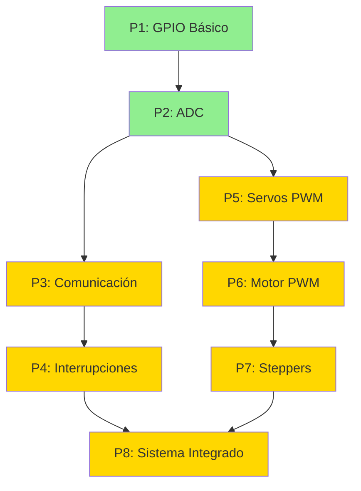

# 📚 MicroPython para RP2040 (Raspberry Pi Pico)

## 🎯 Inicio Rápido

¿Primera vez con RP2040? Empieza aquí:

1. **Lee primero**: [`RESUMEN_TRADUCCION.md`](./RESUMEN_TRADUCCION.md) — Estado del proyecto y qué está listo
2. **Aprende las diferencias**: [`CHECKLIST_PRACTICAS.md`](./CHECKLIST_PRACTICAS.md) — ESP32 vs RP2040
3. **Migra prácticas**: [`GUIA_MIGRACION.md`](./GUIA_MIGRACION.md) — Cómo adaptar P3-P8
4. **Automatiza**: [`SCRIPTS_UTILIDAD.md`](./SCRIPTS_UTILIDAD.md) — Comandos PowerShell útiles

---

## 📖 Documentación Principal

| Archivo | Propósito | Estado |
|---------|-----------|--------|
| [`README.md`](./README.md) | Este archivo (índice general) | ✅ |
| [`RESUMEN_TRADUCCION.md`](./RESUMEN_TRADUCCION.md) | Estado completo del proyecto, logros, métricas | ✅ |
| [`CHECKLIST_PRACTICAS.md`](./CHECKLIST_PRACTICAS.md) | Checklist de 8 prácticas + tabla comparativa | ✅ |
| [`GUIA_MIGRACION.md`](./GUIA_MIGRACION.md) | Guía detallada P3-P8 con código | ✅ |
| [`SCRIPTS_UTILIDAD.md`](./SCRIPTS_UTILIDAD.md) | Scripts PowerShell para automatizar | ✅ |

---

## 🎓 Prácticas Disponibles

### ✅ Completas y Listas para Usar

| # | Nombre | Descripción | Archivos | Tiempo |
|---|--------|-------------|----------|--------|
| **P1** | [GPIO Básico](./P1/) | LEDs, botones, menú interactivo | `boot.py`, `main.py`, `PINES.md`, `README.md` | 30 min |
| **P2** | [ADC](./P2/) | Lectura analógica, filtro, CSV | `boot.py`, `main.py`, `PINES.md`, `README.md` | 45 min |

### 📋 Con Guía de Migración

| # | Nombre | Guía en | Dificultad | Tiempo Est. |
|---|--------|---------|------------|-------------|
| **P3** | Comunicación Serial | [`GUIA_MIGRACION.md`](./GUIA_MIGRACION.md#-p3---comunicación-serial-pendiente) | ⭐⭐ Media | 2-3h |
| **P4** | Interrupciones | [`GUIA_MIGRACION.md`](./GUIA_MIGRACION.md#-p4---interrupciones-pendiente) | ⭐ Fácil | 1-2h |
| **P5** | Servos PWM | [`GUIA_MIGRACION.md`](./GUIA_MIGRACION.md#-p5---servos-pwm-pendiente) | ⭐ Fácil | 1-2h |
| **P6** | Motor PWM | [`GUIA_MIGRACION.md`](./GUIA_MIGRACION.md#-p6---motor-pwm-pendiente) | ⭐ Fácil | 1h |
| **P7** | Steppers | [`GUIA_MIGRACION.md`](./GUIA_MIGRACION.md#-p7---steppers-pendiente) | ⭐⭐ Media | 2h |
| **P8** | Sistema Integrado | [`GUIA_MIGRACION.md`](./GUIA_MIGRACION.md#-p8---sistema-integrado-aeronáutico-pendiente) | ⭐⭐⭐ Difícil | 4-6h |

---

## 🚀 Cómo Empezar

### 1. Instalar MicroPython en tu Pico

```powershell
# Descargar firmware
$url = "https://micropython.org/resources/firmware/RPI_PICO-20241025-v1.24.0.uf2"
Invoke-WebRequest -Uri $url -OutFile "micropython-pico.uf2"

# Instrucciones:
# 1. Mantén BOOTSEL presionado y conecta el Pico
# 2. Copia el archivo .uf2 a la unidad RPI-RP2
# 3. El Pico se reiniciará con MicroPython
```

### 2. Instalar Thonny (IDE recomendado)

```powershell
winget install --id=AivarAnnamaa.Thonny -e
```

### 3. Ejecutar P1 (Ejemplo)

```powershell
# 1. Abre Thonny
# 2. Conecta el Pico (selecciona "MicroPython (Raspberry Pi Pico)")
# 3. Abre P1/main.py
# 4. Guarda en el Pico (File > Save as... > Raspberry Pi Pico)
# 5. Presiona F5 para ejecutar
```

---

## 📊 Comparativa Rápida: ESP32 vs RP2040

| Característica | ESP32 | RP2040 | Ganador |
|----------------|-------|--------|---------|
| **Precio** | $5-10 | $4-6 | 🏆 RP2040 |
| **CPU** | 240 MHz | 133 MHz | 🏆 ESP32 |
| **Cores** | 1-2 | 2 | — |
| **RAM** | 520 KB | 264 KB | 🏆 ESP32 |
| **GPIO** | 34-48 | 26 | 🏆 ESP32 |
| **ADC canales** | 18 × 12-bit | 3 × 12-bit | 🏆 ESP32 |
| **PWM canales** | 16 | 16 | — |
| **WiFi/BT** | ✅ Integrado | ❌ Solo Pico W | 🏆 ESP32 |
| **USB nativo** | ❌ | ✅ USB 1.1 | 🏆 RP2040 |
| **Costo de entrada** | Medio | Bajo | 🏆 RP2040 |
| **Facilidad de uso** | Media | Alta | 🏆 RP2040 |

---

## 🔧 Diferencias Clave de Código

### ADC
```python
# ESP32
from machine import ADC, Pin
adc = ADC(Pin(34))
adc.atten(ADC.ATTN_11DB)
adc.width(ADC.WIDTH_12BIT)
raw = adc.read()  # 0-4095
voltage = (raw / 4095) * 3.3

# RP2040
from machine import ADC
adc = ADC(26)  # GP26 = ADC0
raw = adc.read_u16()  # 0-65535
voltage = (raw / 65535) * 3.3
```

### PWM
```python
# Idéntico en ambos
from machine import Pin, PWM
pwm = PWM(Pin(16))
pwm.freq(1000)
pwm.duty_u16(32768)  # 50%
```

### Pines
```python
# ESP32 → RP2040
GPIO2  → GP25  # LED onboard
GPIO34 → GP26  # ADC0
GPIO4  → GP16  # GPIO genérico
```

---

## 📦 Estructura de Carpetas

```
RP2040/
├── README.md                    ← Este archivo
├── RESUMEN_TRADUCCION.md        ← Estado del proyecto
├── CHECKLIST_PRACTICAS.md       ← Checklist + comparativa
├── GUIA_MIGRACION.md            ← Guía P3-P8
├── SCRIPTS_UTILIDAD.md          ← Scripts PowerShell
│
├── _template/                   ← Plantilla para nuevas prácticas
│   ├── README.md
│   ├── PINES.md
│   ├── boot.py
│   └── main.py
│
├── P1/                          ✅ COMPLETA
│   ├── README.md
│   ├── PINES.md
│   ├── boot.py
│   ├── main.py
│   ├── pymakr.conf
│   └── assets/
│       └── wiring.mmd
│
├── P2/                          ✅ COMPLETA
│   ├── README.md
│   ├── PINES.md
│   ├── boot.py
│   ├── main.py
│   ├── pymakr.conf
│   ├── docs/
│   │   └── oscilograma.md
│   └── assets/
│       └── wiring.mmd
│
├── P3/                          📋 Con guía
├── P4/                          📋 Con guía
├── P5/                          📋 Con guía
├── P6/                          📋 Con guía
├── P7/                          📋 Con guía
└── P8/                          📋 Con guía
```

---

## 🎯 Roadmap

### ✅ Fase 1: Infraestructura (Completada)
- [x] Documentación maestra
- [x] P1 - GPIO Básico
- [x] P2 - ADC
- [x] Guías de migración P3-P8

### 🔄 Fase 2: Comunicación y Control (En progreso)
- [ ] P3 - UART/I2C/SPI
- [ ] P4 - Interrupciones

### ⏳ Fase 3: Actuadores (Pendiente)
- [ ] P5 - Servos PWM
- [ ] P6 - Motor PWM
- [ ] P7 - Steppers

### ⏳ Fase 4: Integración (Pendiente)
- [ ] P8 - Sistema Aeronáutico Integrado

### 🔮 Fase 5: Mejoras (Futuro)
- [ ] Diagramas Mermaid para todas las prácticas
- [ ] Videos tutoriales
- [ ] Ejemplos adicionales
- [ ] PDFs descargables

---

## 💡 Tips y Trucos

### Atajos de Thonny
- `F5` - Ejecutar script actual
- `Ctrl+D` - Reiniciar intérprete
- `Ctrl+C` - Detener ejecución
- `Ctrl+Shift+S` - Guardar como... (en Pico)

### Debugging
```python
# Imprimir variables en REPL
print(f"ADC: {adc.read_u16()}, Voltage: {voltage:.2f}V")

# Timing de código
from time import ticks_us, ticks_diff
t0 = ticks_us()
# ... código ...
print(f"Tiempo: {ticks_diff(ticks_us(), t0)} μs")
```

### Optimización de Memoria
```python
# Liberar memoria
import gc
gc.collect()
print(f"RAM libre: {gc.mem_free()} bytes")
```

---

## 🆘 Troubleshooting Común

| Problema | Solución |
|----------|----------|
| Pico no detectado | Mantén BOOTSEL presionado al conectar |
| Error de sintaxis | Verifica indentación (4 espacios, no tabs) |
| Import "machine" no resuelve | Normal en editor PC; funciona en Pico |
| ADC saturado | Verifica voltaje ≤3.3V (NO 5V) |
| PWM sin señal | Confirma pin compatible (ver datasheet) |
| Memoria insuficiente | Usa `gc.collect()` o simplifica código |

---

## 📚 Recursos Oficiales

- **MicroPython RP2040**: https://docs.micropython.org/en/latest/rp2/quickref.html
- **Raspberry Pi Pico**: https://www.raspberrypi.com/documentation/microcontrollers/raspberry-pi-pico.html
- **RP2040 Datasheet**: https://datasheets.raspberrypi.com/rp2040/rp2040-datasheet.pdf
- **Pico Pinout**: https://datasheets.raspberrypi.com/pico/Pico-R3-A4-Pinout.pdf
- **Thonny IDE**: https://thonny.org

---

## 🤝 Contribuir

Este proyecto es parte de SISELA-Init (EU97). Para contribuir:

1. Fork el repositorio
2. Crea una rama para tu práctica (`git checkout -b feature/p3-rp2040`)
3. Sigue el patrón de P1 y P2
4. Usa las guías de `GUIA_MIGRACION.md`
5. Commit con mensajes descriptivos
6. Pull request con descripción detallada

---

## 📄 Licencia

Material académico para uso educativo. Atribución requerida.

---

## 📞 Soporte

- **Issues**: https://github.com/EU97/SISELA-Init/issues
- **Documentación**: Lee archivos `.md` en esta carpeta
- **Comparativa ESP32**: Ver carpeta `../ESP32/`

---

**Última actualización**: Noviembre 3, 2025  
**Versión**: 1.0  
**Mantenedor**: EU97  
**Estado**: 🟢 Operacional (P1-P2 completas, P3-P8 con guías)

---

## 🎓 Orden Recomendado de Aprendizaje



🟢 Verde = Completa | 🟡 Amarillo = Con guía de migración

---

¡Bienvenido a MicroPython en RP2040! 🚀
