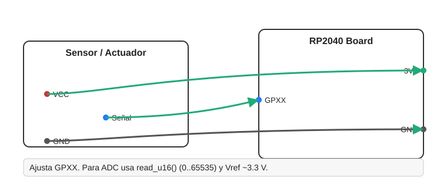

# [Pn] · Título de la práctica (RP2040 + MicroPython)

Breve descripción: qué hace la práctica y qué aprenderás.

## Objetivos
- Objetivo 1
- Objetivo 2
- Objetivo 3

## Materiales
- Placa RP2040 (Raspberry Pi Pico, etc.)
- Sensores/actuadores específicos
- Cables y protoboard

## Diagrama de conexiones

- Fuente Mermaid editable: `assets/wiring.mmd`.
- Notas de seguridad/voltaje si aplican (ADC: read_u16 con Vref ~3.3V).

## Mapa de pines

Consulta `PINES.md` para ver el mapeo detallado.

## Código

Archivo principal: `main.py`

- Parámetros ajustables al inicio (pines, frecuencias, constantes).
- Estructura recomendada: Config HW, Utilidades, Clases, Loop principal.
- Formato de salida: CSV con cabecera o logs con prefijos.

## Ejecución (Pymakr u otra herramienta)
1. Conecta la placa por USB y selecciona el puerto.
2. Sube y ejecuta `main.py`.
3. Observa la consola y valida el comportamiento esperado.

## Visualización de datos

Revisa `docs/oscilograma.md` para graficar y analizar datos (si aplica CSV).

## Actividades sugeridas
- Extensión/ajuste 1
- Extensión/ajuste 2
- Extensión/ajuste 3

## Solución de problemas
- Problema común 1 → Solución
- Problema común 2 → Solución
- Problema común 3 → Solución

## Licencia y créditos
Texto breve de licencia/uso académico.
